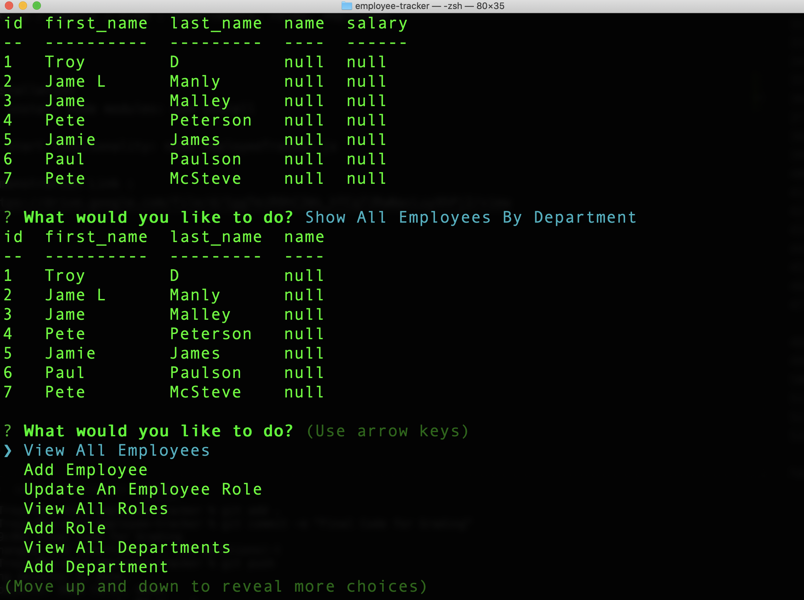

# Employee Tracker:
This is a command-line application that will allow you to.
Create / Update / View : departments, roles, employees

# Installation
To install node modules: npm install

# Execution
To start functionality: node employeeTracker.js

# Demo

# Video Demonstration Link :
https://drive.google.com/file/d/1ggTmiR9hC2Ws_hTCq7JRwNacLuyXhPj2/view

